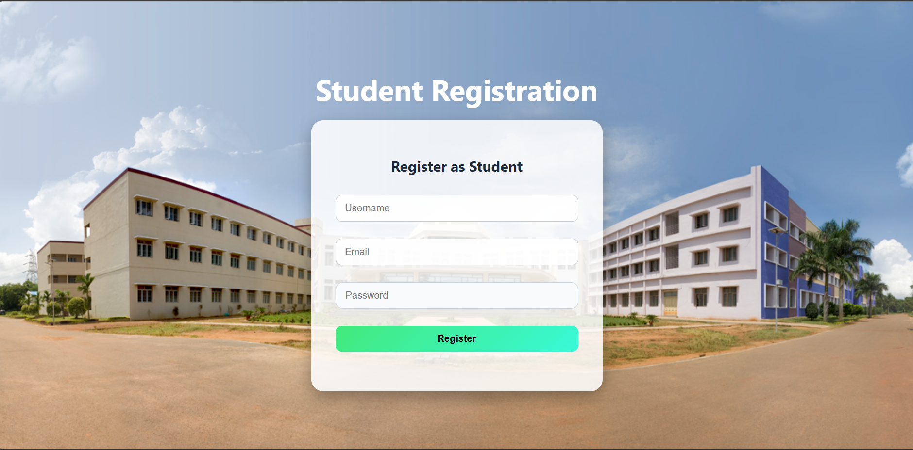
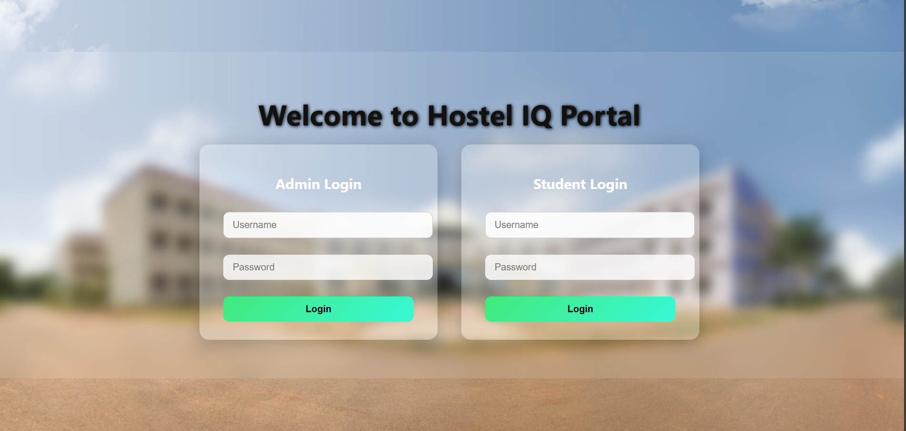
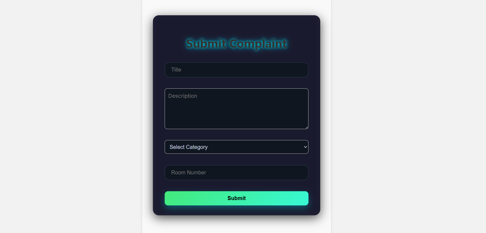
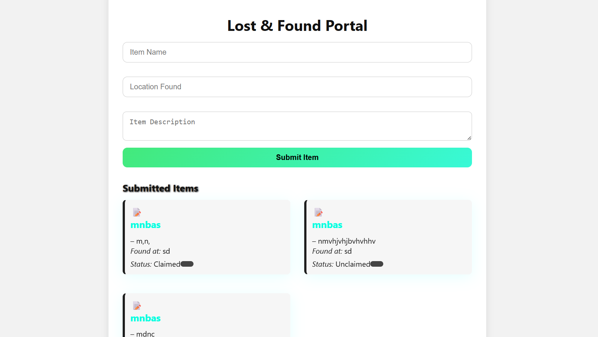
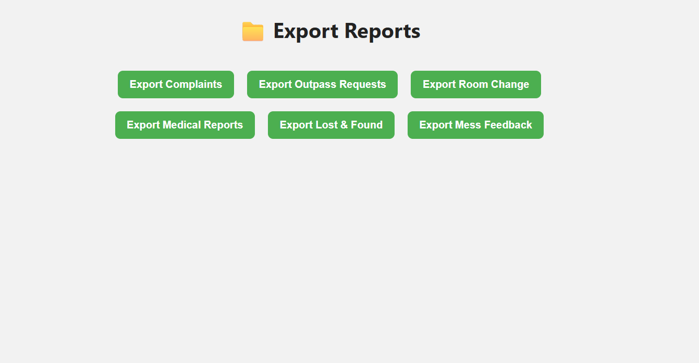

# 🏨 Hostel IQ – Advanced Hostel Helpdesk Portal

A **next-gen full-stack hostel helpdesk system** built with Django, React, and MySQL — offering advanced complaint tracking, room change workflows, emergency reporting, and more — tailored for **students and admins** with secure, role-based dashboards.

## 🌐 Live Demo

[🚀 Visit Live Demo](https://hostel-iq.vercel.app)

---
## 📸 UI Screenshots

### 🏠 Home Page


### 📝 Registration Page


### 🔐 Login Page


### 🧑‍🎓 Student Dashboard


### 🛡️ Admin Dashboard


### 📝 Submit Complaint


### 📄 View Complaints


### 🔄 Room Change Request


### 🏥 Medical Emergency Report


### 🎒 Lost & Found


### 🚪 Out Pass Request


### 📤 Admin Data Export


---

## ✨ Features

### 👨‍🎓 Student Portal

* 🔐 JWT-based login with auto token refresh
* 📝 Complaint submission (title, description, image, room number)
* 🚪 Room change request (current & desired room, reason)
* 📤 Out-pass request (reason, destination, date range)
* 🩺 Emergency report (urgency, issue, location)
* 🍛 Anonymous mess feedback
* 📦 Lost & Found reporting & tracking
* 🧾 View history of personal requests

### 🧑‍💼 Admin Panel

* 🧾 View/manage complaints with status tracking
* 🚪 Approve/reject room change & outpass
* 🩺 Manage medical emergency statuses
* 📦 Update Lost & Found claims
* 📢 Post student-wide notices
* 📊 Export CSV reports (complaints, outpasses, medical)
* 📈 View feedback, audit logs, student counts

---

## 🧰 Tech Stack

### 🔠 Frontend

* **React.js** with **functional components**
* **Tailwind CSS** for a sleek and responsive design
* **React Router DOM** for page navigation
* **Axios** for API requests
* **Lucide Icons & React Icons** for beautiful dashboards

### 🔙 Backend

* **Django + Django REST Framework** for REST APIs
* **MySQL** for database
* **Pandas** for CSV export features
* **CustomUser model** with `is_admin` and `is_student` roles

### 🔐 Authentication

* **JWT** access/refresh tokens
* Token refresh logic in frontend utils
* Role-based protected routes and API permissions

---

## 📁 Project Structure

```
hostel-iq/
├── hostel_backend/           # Django Project Root
│   ├── helpdesk/             # All helpdesk models, views, serializers, URLs
│   └── users/                # CustomUser, auth APIs (login/register)
├── frontend/
│   ├── public/               # Public assets (logo, index.html)
│   └── src/
│       ├── components/       # Reusable components (Navbar, Cards, etc.)
│       ├── pages/
│       │   ├── admin/        # Admin dashboard & feature pages
│       │   └── student/      # Student dashboard & feature pages
│       └── utils/            # JWT utilities, Axios instance, auth helpers
```

---

## 🚀 Getting Started

### ⚙️ Backend Setup

```bash
cd hostel_backend
python -m venv env
source env/bin/activate  # Windows: env\Scripts\activate
pip install -r requirements.txt
python manage.py makemigrations
python manage.py migrate
python manage.py runserver
```

### 💻 Frontend Setup

```bash
cd frontend
npm install
npm start
```

---

## 🔐 Sample Admin Credentials

```txt
username: admin
password: admin123
```

> ⚠️ Change default credentials before production deployment

---

## 🛡️ Security Measures

* JWT Access + Refresh token logic with auto-expiry check
* Role-based endpoint protection using DRF permissions
* Route-level guards for Student and Admin pages
* Input sanitization and backend validations

---

## 🔮 Planned Enhancements

* 🔔 Push Notifications for complaint updates
* 📱 Mobile App (React Native)
* 🤖 AI-powered Chatbot for instant help
* 🔁 API versioning for stability

---

## 📃 License

This project is licensed under the **MIT License**.

> MIT License
>
> Copyright (c) 2025 Tharun Lokesh
>
> Permission is hereby granted, free of charge, to any person obtaining a copy
> of this software and associated documentation files (the "Software"), to deal
> in the Software without restriction, including without limitation the rights
> to use, copy, modify, merge, publish, distribute, sublicense, and/or sell
> copies of the Software, and to permit persons to whom the Software is
> furnished to do so, subject to the following conditions:
>
> The above copyright notice and this permission notice shall be included in all
> copies or substantial portions of the Software.
>
> THE SOFTWARE IS PROVIDED "AS IS", WITHOUT WARRANTY OF ANY KIND, EXPRESS OR
> IMPLIED, INCLUDING BUT NOT LIMITED TO THE WARRANTIES OF MERCHANTABILITY,
> FITNESS FOR A PARTICULAR PURPOSE AND NONINFRINGEMENT. IN NO EVENT SHALL THE
> AUTHORS OR COPYRIGHT HOLDERS BE LIABLE FOR ANY CLAIM, DAMAGES OR OTHER
> LIABILITY, WHETHER IN AN ACTION OF CONTRACT, TORT OR OTHERWISE, ARISING FROM,
> OUT OF OR IN CONNECTION WITH THE SOFTWARE OR THE USE OR OTHER DEALINGS IN THE
> SOFTWARE.

---

## 👨‍💻 Author

**Tharun Lokesh Uggina**
🔗 [LinkedIn](https://www.linkedin.com/in/tharun-lokesh-uggina)
📧 [tharunlokeshu@gmail.com](mailto:tharunlokeshu@gmail.com)

---

## 🌟 Show Your Support

If this project helped you, star ⭐ it, fork 🍴 it, or share it 💬 with your friends!

---
